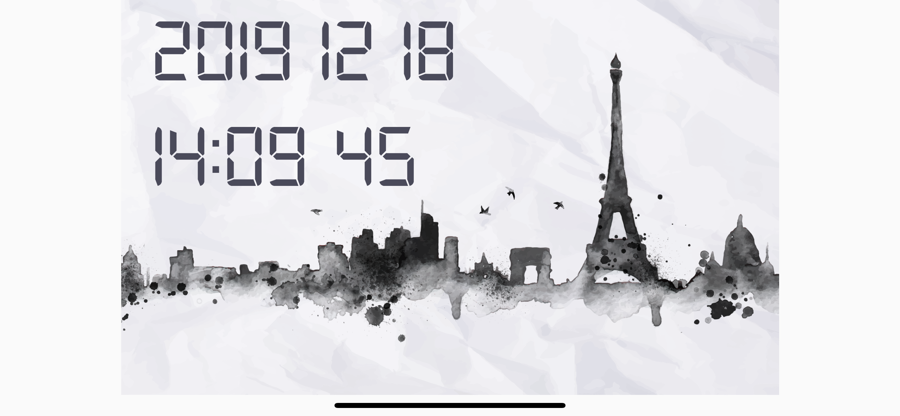

# Flutter Clock
Basic flutter practice

This is a [flutter clock challenge](https://flutter.dev/clock) I make a really easy version.

# Demo

# Result
In this challenge I tried some basic function.
- Add background image
- Custom font
- Timer and datetime

